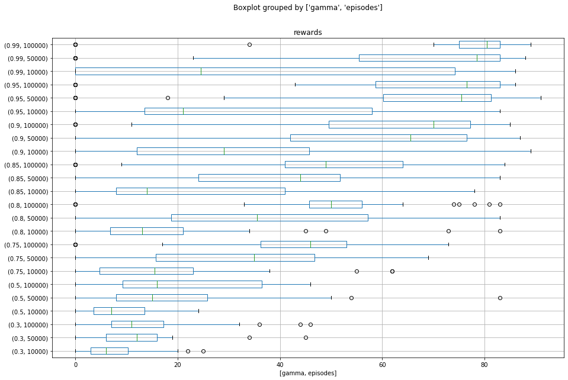
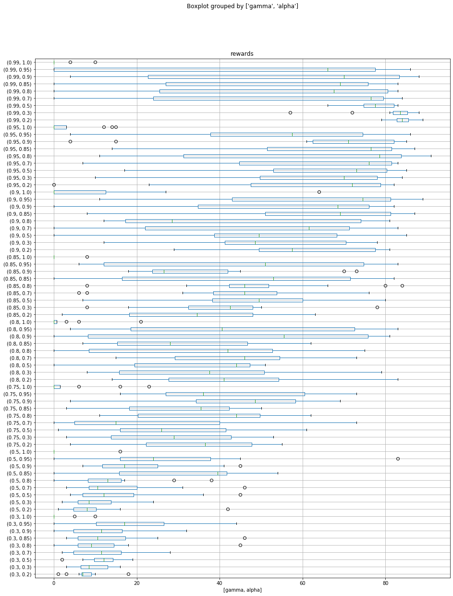
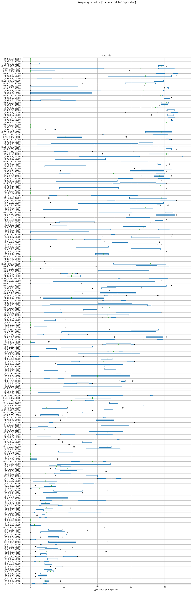

```python
import pandas as pd
df = pd.read_csv("results_frozen_lake.csv")
```


```python
df.head()
```


<div>
<style scoped>
    .dataframe tbody tr th:only-of-type {
        vertical-align: middle;
    }

    .dataframe tbody tr th {
        vertical-align: top;
    }

    .dataframe thead th {
        text-align: right;
    }
</style>
<table border="1" class="dataframe">
  <thead>
    <tr style="text-align: right;">
      <th></th>
      <th>alpha</th>
      <th>gamma</th>
      <th>epsilon</th>
      <th>episodes</th>
      <th>rewards</th>
    </tr>
  </thead>
  <tbody>
    <tr>
      <th>0</th>
      <td>1.0</td>
      <td>0.99</td>
      <td>0.9</td>
      <td>10000</td>
      <td>4</td>
    </tr>
    <tr>
      <th>1</th>
      <td>1.0</td>
      <td>0.99</td>
      <td>0.9</td>
      <td>50000</td>
      <td>0</td>
    </tr>
    <tr>
      <th>2</th>
      <td>1.0</td>
      <td>0.99</td>
      <td>0.9</td>
      <td>100000</td>
      <td>0</td>
    </tr>
    <tr>
      <th>3</th>
      <td>1.0</td>
      <td>0.99</td>
      <td>0.8</td>
      <td>10000</td>
      <td>10</td>
    </tr>
    <tr>
      <th>4</th>
      <td>1.0</td>
      <td>0.99</td>
      <td>0.8</td>
      <td>50000</td>
      <td>0</td>
    </tr>
  </tbody>
</table>
</div>


```python
df.sort_values(by=['rewards'], ascending=False)
```


<div>
<style scoped>
    .dataframe tbody tr th:only-of-type {
        vertical-align: middle;
    }

    .dataframe tbody tr th {
        vertical-align: top;
    }

    .dataframe thead th {
        text-align: right;
    }
</style>
<table border="1" class="dataframe">
  <thead>
    <tr style="text-align: right;">
      <th></th>
      <th>alpha</th>
      <th>gamma</th>
      <th>epsilon</th>
      <th>episodes</th>
      <th>rewards</th>
    </tr>
  </thead>
  <tbody>
    <tr>
      <th>400</th>
      <td>0.80</td>
      <td>0.95</td>
      <td>0.8</td>
      <td>50000</td>
      <td>91</td>
    </tr>
    <tr>
      <th>397</th>
      <td>0.80</td>
      <td>0.95</td>
      <td>0.9</td>
      <td>50000</td>
      <td>90</td>
    </tr>
    <tr>
      <th>779</th>
      <td>0.20</td>
      <td>0.99</td>
      <td>0.5</td>
      <td>100000</td>
      <td>89</td>
    </tr>
    <tr>
      <th>120</th>
      <td>0.95</td>
      <td>0.90</td>
      <td>0.9</td>
      <td>10000</td>
      <td>89</td>
    </tr>
    <tr>
      <th>773</th>
      <td>0.20</td>
      <td>0.99</td>
      <td>0.8</td>
      <td>100000</td>
      <td>89</td>
    </tr>
    <tr>
      <th>...</th>
      <td>...</td>
      <td>...</td>
      <td>...</td>
      <td>...</td>
      <td>...</td>
    </tr>
    <tr>
      <th>88</th>
      <td>1.00</td>
      <td>0.30</td>
      <td>0.8</td>
      <td>50000</td>
      <td>0</td>
    </tr>
    <tr>
      <th>89</th>
      <td>1.00</td>
      <td>0.30</td>
      <td>0.8</td>
      <td>100000</td>
      <td>0</td>
    </tr>
    <tr>
      <th>91</th>
      <td>1.00</td>
      <td>0.30</td>
      <td>0.7</td>
      <td>50000</td>
      <td>0</td>
    </tr>
    <tr>
      <th>92</th>
      <td>1.00</td>
      <td>0.30</td>
      <td>0.7</td>
      <td>100000</td>
      <td>0</td>
    </tr>
    <tr>
      <th>94</th>
      <td>1.00</td>
      <td>0.30</td>
      <td>0.5</td>
      <td>50000</td>
      <td>0</td>
    </tr>
  </tbody>
</table>
<p>864 rows × 5 columns</p>
</div>


```python
df.corr()
```


<div>
<style scoped>
    .dataframe tbody tr th:only-of-type {
        vertical-align: middle;
    }

    .dataframe tbody tr th {
        vertical-align: top;
    }

    .dataframe thead th {
        text-align: right;
    }
</style>
<table border="1" class="dataframe">
  <thead>
    <tr style="text-align: right;">
      <th></th>
      <th>alpha</th>
      <th>gamma</th>
      <th>epsilon</th>
      <th>episodes</th>
      <th>rewards</th>
    </tr>
  </thead>
  <tbody>
    <tr>
      <th>alpha</th>
      <td>1.000000e+00</td>
      <td>-7.479680e-17</td>
      <td>7.937607e-19</td>
      <td>-1.086646e-17</td>
      <td>-0.157279</td>
    </tr>
    <tr>
      <th>gamma</th>
      <td>-7.479680e-17</td>
      <td>1.000000e+00</td>
      <td>-7.114041e-17</td>
      <td>1.847231e-17</td>
      <td>0.507427</td>
    </tr>
    <tr>
      <th>epsilon</th>
      <td>7.937607e-19</td>
      <td>-7.114041e-17</td>
      <td>1.000000e+00</td>
      <td>0.000000e+00</td>
      <td>0.010795</td>
    </tr>
    <tr>
      <th>episodes</th>
      <td>-1.086646e-17</td>
      <td>1.847231e-17</td>
      <td>0.000000e+00</td>
      <td>1.000000e+00</td>
      <td>0.323295</td>
    </tr>
    <tr>
      <th>rewards</th>
      <td>-1.572794e-01</td>
      <td>5.074271e-01</td>
      <td>1.079544e-02</td>
      <td>3.232951e-01</td>
      <td>1.000000</td>
    </tr>
  </tbody>
</table>
</div>


```python
df.boxplot(column='rewards', by=['gamma','episodes'], figsize=(15,10), vert=False)
```


    <matplotlib.axes._subplots.AxesSubplot at 0x11a50e310>





```python
df.boxplot(column='rewards', by=['gamma','alpha'], figsize=(15,20), vert=False)
```


    <matplotlib.axes._subplots.AxesSubplot at 0x1240523d0>





```python
df.boxplot(column='rewards', by=['gamma','alpha','episodes'], figsize=(15,50), vert=False)
```


    <matplotlib.axes._subplots.AxesSubplot at 0x1278508d0>





```python
best = df[(df['gamma'] > 0.95) & (df['alpha'] <= 0.3)]
```


```python
best
```


<div>
<style scoped>
    .dataframe tbody tr th:only-of-type {
        vertical-align: middle;
    }

    .dataframe tbody tr th {
        vertical-align: top;
    }

    .dataframe thead th {
        text-align: right;
    }
</style>
<table border="1" class="dataframe">
  <thead>
    <tr style="text-align: right;">
      <th></th>
      <th>alpha</th>
      <th>gamma</th>
      <th>epsilon</th>
      <th>episodes</th>
      <th>rewards</th>
    </tr>
  </thead>
  <tbody>
    <tr>
      <th>672</th>
      <td>0.3</td>
      <td>0.99</td>
      <td>0.9</td>
      <td>10000</td>
      <td>86</td>
    </tr>
    <tr>
      <th>673</th>
      <td>0.3</td>
      <td>0.99</td>
      <td>0.9</td>
      <td>50000</td>
      <td>82</td>
    </tr>
    <tr>
      <th>674</th>
      <td>0.3</td>
      <td>0.99</td>
      <td>0.9</td>
      <td>100000</td>
      <td>85</td>
    </tr>
    <tr>
      <th>675</th>
      <td>0.3</td>
      <td>0.99</td>
      <td>0.8</td>
      <td>10000</td>
      <td>85</td>
    </tr>
    <tr>
      <th>676</th>
      <td>0.3</td>
      <td>0.99</td>
      <td>0.8</td>
      <td>50000</td>
      <td>57</td>
    </tr>
    <tr>
      <th>677</th>
      <td>0.3</td>
      <td>0.99</td>
      <td>0.8</td>
      <td>100000</td>
      <td>81</td>
    </tr>
    <tr>
      <th>678</th>
      <td>0.3</td>
      <td>0.99</td>
      <td>0.7</td>
      <td>10000</td>
      <td>85</td>
    </tr>
    <tr>
      <th>679</th>
      <td>0.3</td>
      <td>0.99</td>
      <td>0.7</td>
      <td>50000</td>
      <td>88</td>
    </tr>
    <tr>
      <th>680</th>
      <td>0.3</td>
      <td>0.99</td>
      <td>0.7</td>
      <td>100000</td>
      <td>82</td>
    </tr>
    <tr>
      <th>681</th>
      <td>0.3</td>
      <td>0.99</td>
      <td>0.5</td>
      <td>10000</td>
      <td>72</td>
    </tr>
    <tr>
      <th>682</th>
      <td>0.3</td>
      <td>0.99</td>
      <td>0.5</td>
      <td>50000</td>
      <td>82</td>
    </tr>
    <tr>
      <th>683</th>
      <td>0.3</td>
      <td>0.99</td>
      <td>0.5</td>
      <td>100000</td>
      <td>88</td>
    </tr>
    <tr>
      <th>768</th>
      <td>0.2</td>
      <td>0.99</td>
      <td>0.9</td>
      <td>10000</td>
      <td>83</td>
    </tr>
    <tr>
      <th>769</th>
      <td>0.2</td>
      <td>0.99</td>
      <td>0.9</td>
      <td>50000</td>
      <td>84</td>
    </tr>
    <tr>
      <th>770</th>
      <td>0.2</td>
      <td>0.99</td>
      <td>0.9</td>
      <td>100000</td>
      <td>82</td>
    </tr>
    <tr>
      <th>771</th>
      <td>0.2</td>
      <td>0.99</td>
      <td>0.8</td>
      <td>10000</td>
      <td>79</td>
    </tr>
    <tr>
      <th>772</th>
      <td>0.2</td>
      <td>0.99</td>
      <td>0.8</td>
      <td>50000</td>
      <td>84</td>
    </tr>
    <tr>
      <th>773</th>
      <td>0.2</td>
      <td>0.99</td>
      <td>0.8</td>
      <td>100000</td>
      <td>89</td>
    </tr>
    <tr>
      <th>774</th>
      <td>0.2</td>
      <td>0.99</td>
      <td>0.7</td>
      <td>10000</td>
      <td>79</td>
    </tr>
    <tr>
      <th>775</th>
      <td>0.2</td>
      <td>0.99</td>
      <td>0.7</td>
      <td>50000</td>
      <td>85</td>
    </tr>
    <tr>
      <th>776</th>
      <td>0.2</td>
      <td>0.99</td>
      <td>0.7</td>
      <td>100000</td>
      <td>87</td>
    </tr>
    <tr>
      <th>777</th>
      <td>0.2</td>
      <td>0.99</td>
      <td>0.5</td>
      <td>10000</td>
      <td>83</td>
    </tr>
    <tr>
      <th>778</th>
      <td>0.2</td>
      <td>0.99</td>
      <td>0.5</td>
      <td>50000</td>
      <td>85</td>
    </tr>
    <tr>
      <th>779</th>
      <td>0.2</td>
      <td>0.99</td>
      <td>0.5</td>
      <td>100000</td>
      <td>89</td>
    </tr>
  </tbody>
</table>
</div>


# Conclusão

Os melhores resultados são quando temos um gamma de 0.99 e um alpha baixo (abaixo de 0.3) - não foi avaliado alpha de 0.1. O valor de epsilon não parece impactar e o valor de episodes também não. Lembrando que os valores de episodes testados foram 10, 50 e 100 mil. 

Desta forma, sugere-se os seguintes hiperparâmetros: 
* alpha = 0.2
* gamma = 0.99
* epsilon = 0.8
* episodes = 100000


```python

```
